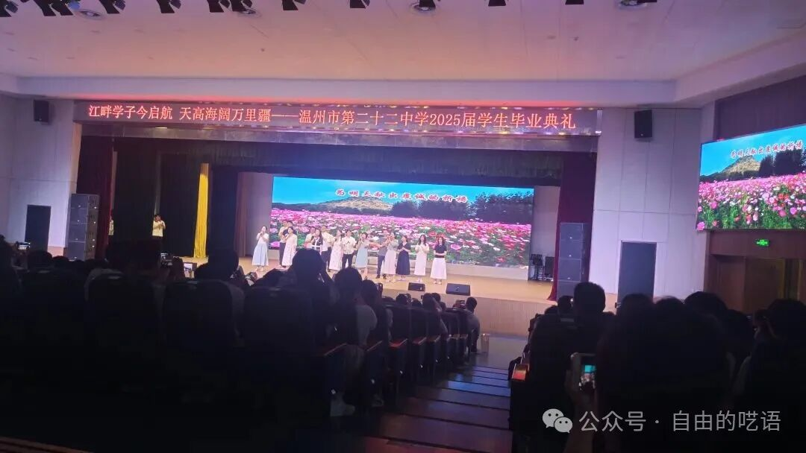
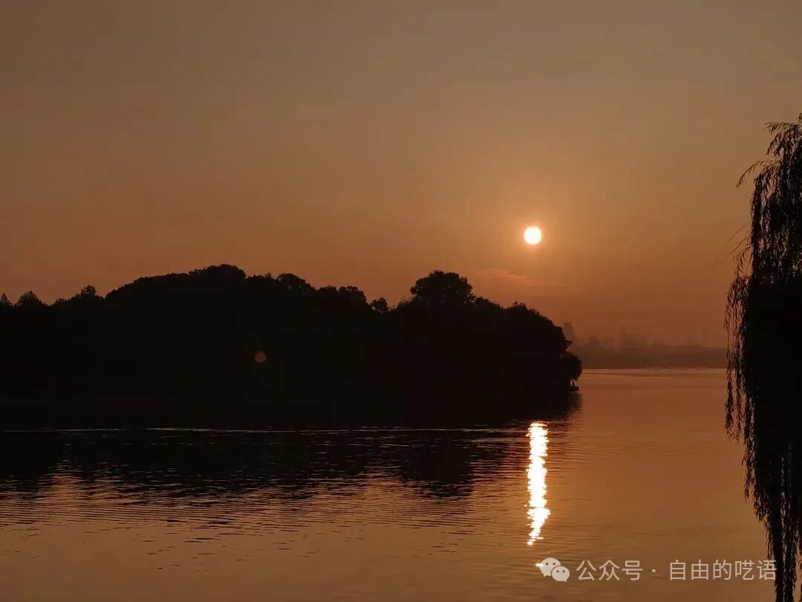
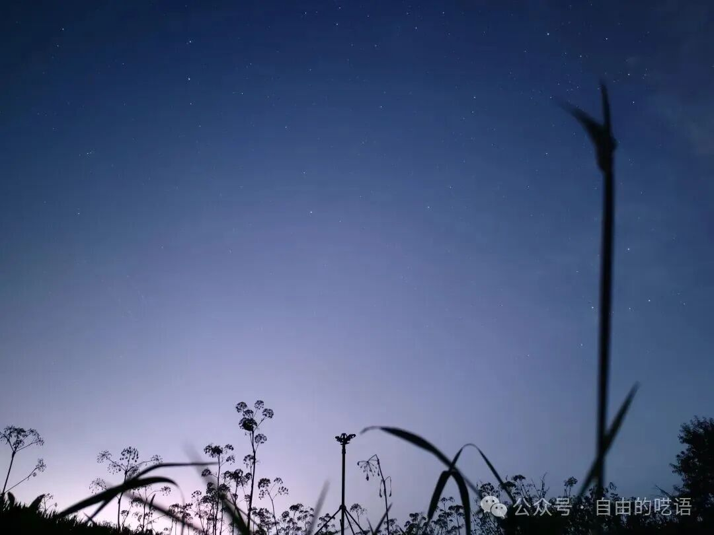
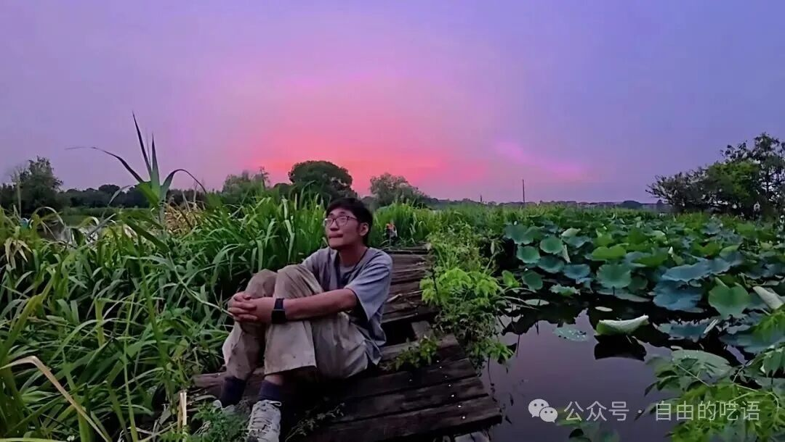
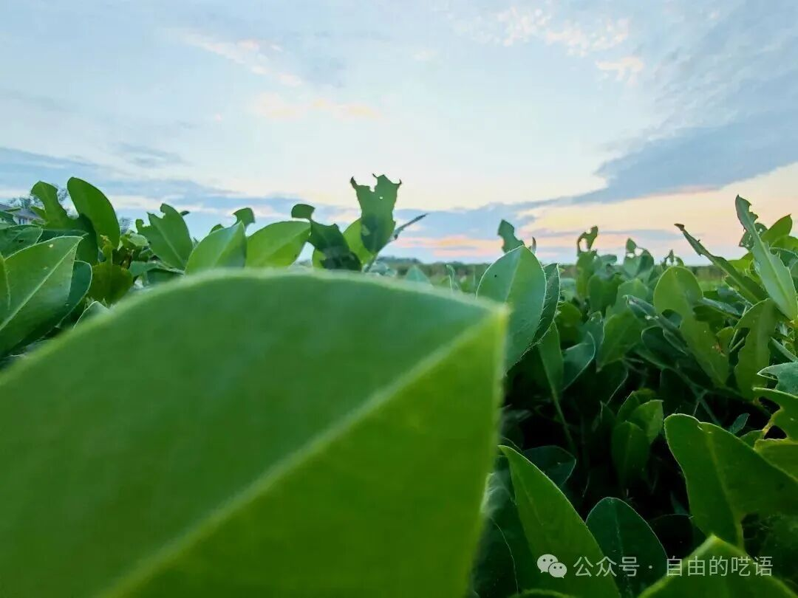

# 关于人生
我还是得要写一下这个课题吧。  

我会以我短浅的认知去写，不满意，不支持也无妨，我写的不是当然不是真理，但也不是观点，而是我的一种感受。  

人生这个话题，许多人都会去想，在人生的各个阶段都会，而想的时候，一般是在想这个问题吧  

## 人，为什么活着？

首先，活着，我们活着是需要一种动机的。而当我用一种理性的思想去分析的时候，我发现我是被上帝所遗弃了的，或许没有上帝，或许我才是上帝。在这里，被抛弃在了时间长河里，许多人也是如此，各自乘着一叶小舟，被迫驶向死亡的终点。
而我们的轨迹，随着时间长河流过，会逐渐黯淡，最终消失。在这种结局既定的前提下，我们需要思考，结局重要还是过程重要。这似乎是个很难辩论的问题。   
当我们把时间尺度放大以后，就会发现，我们，社会，人类文明，宇宙，都毫无意义，一切只是在不断的熵增，最终达到最大熵后停止，达到热寂状态，对，宏观来看，我们是熵增的产物，是熵增最强力的执行者，同时又是能意识到这一点并试图与之抗争的存在。 所以，你存在的本质目的，不过是宇宙自发产生用于加速熵增的机器，最终逃离不了泯灭。   
而时间尺度放小，更贴近我们，更加会引起我们这些生命的一种自我意识的共鸣，“宇宙熵增跟我有半毛钱关系，多我一个不多，少我一个不少，没我照样能达成目的，我还有别的责任”，于是，这些机器团结起来，有意识或者无意识的发展，这也许是宇宙的安排，因为机器发展越多，熵增越快。“人类命运共同体应当团结起来，不断发展，创造出伟大而璀璨的人类文明”，嗯，文明也是会消亡的，最终依然归于热寂。文明尺度还是太大了点，对于寿命短浅的生命，依旧没有赢得共鸣，他们想听的是——人活着有什么意义，我为什么活着，我该怎么活着，他们不在乎所谓的人类文明的繁荣与衰败。   
“没有意义”  
他们似乎也知道了  

## 人活着就是为了熵增
客体世界无意义，但是我们主观上建构了“关系论，功利论，体验论，放弃思考论，理想论“，这些，是我们所构建的系统，理论，供大家使用，追逐。可是，意义？，难道没有意义你活不下去了吗，你不是还有所谓的欲望，满足你自私的灵魂，难道凡事都要问意义吗，我写这篇文章有意义吗，我想说的是，追寻意义本身是否已变成骗局，当我们打破一切意义，变得自由之后，才发现，我们会被其他欲望操控，最后，只好赎买，劳累自己的灵魂，又满足自己的灵魂，就这样在社会设局下不断的循环下去。我们另有他路？没有。意义存在有着他自己的意义，存在即合理，杜加尔说过，生活是一种绵延不绝的渴望，渴望不断上升，变得更伟大而高贵。因此，无论是意义，目的，还是欲望，本身只是生命本色，一切行动，都由这些驱使，有意识或无意识，，哪怕是解脱论，也不过是为了满足解脱这样一个欲望罢了，生命生长在渴望的海洋中，向死而生。所以，我们只需问一句，我们渴求的是什么

## 生命的绽放！

***是在抛去结果论以后，一次一次令人热泪盈眶的瞬间***

***是日出月落的静谧***

***是观望银河璀璨***

***是一次一次的自我突破***

***是默默无闻的扎根生长***

……
***如果你仍在追寻着意义，我想说的是，在渴望的海洋中，意义是沉积下来的海浪，是慢慢堆积出来的，不去寻找，反而能够发现。***

他们说:  
- 投身热爱  
>“人生，做喜欢的事是首选。”（河野华）   
- 坚守独特
>“坚持自我，展现你的坚持和热爱。”（Tim）  
- 创造现实
>“乐观，悲观，管它呢，我们会让它发生的。”（马斯克）   
- 接受虚设
>“目的虽是虚设的，可非得有不行，不然琴弦怎么拉紧，拉不紧就弹不响。”（史铁生）    
- 享用无尽
>“惟江上之清风，与山间之明月……是造物者之无尽藏也。”（苏轼）
- 回归当下
>“去码头整点薯条。”（海鸟）      
- 珍惜活着
>	“可是，反正都是死，不论是还是违背命令而死都毫无意义吧。”“你说的没错 全都毫无意义。不论拥有怎样的梦想和希望，不论过着怎样幸福的人生，都和被岩石打碎身体没有区别，结局都是死，那么人生是否没有意义呢 或者说 难道我们的出生就是毫无意义的吗 那些死去的同伴也是吗那些牺牲的士兵们也毫无意义吗 不 不对 那些士兵的意义 将由我们赋予 那些勇敢的死者 那些可悲的死者 我们之所以能这么想 是因为我们是生者 我们会死在这里 将意义托付给下一个生者。这就是与这个残酷世界抗争的唯一手段。”（进击的巨人）
![[d66d9e205fb1668807d6a3dbb15f68c3.jpg]]

……
## 我的思考与感受:
感谢自己活着，也希望你能珍惜，知晓活着不易，《命悬一线》中提到，   

>“生命太短了，就一瞬间，在命运面前我们每个人都太渺小了，只要你不怕好”

**我们不怕，但不代表我们能够浪费。**   
上帝未经我的允许就随意把我抛弃在这个世界，让我活下去，这是我的义务，我相信，上帝知道，权利与义务是对等的，活着，是只属于我们这些生者的，不止一种义务，更是一种权利。
上帝给我最大的权利，就是我选择的权利，我很早就说过，人生是由一个个抉择构成的，因此我们选择活着的方式就是我们在选择抉择的方式。在任何时候，我都有选择的权利，哪怕在集中营，我可以决定我的心态。选择对应的是责任，选择之所以难以做出，不是因为选择本身，而是选择背后的责任，我们选择的权利越大，责任就越大。而你，是你人生的唯一责任人，但，无论是有意义还是无意义，无论是选择虚无主义后的敢于生活，还是选择存在主义后证明自我价值，或是选择仅仅活着，等待一天巨石落下，就此落幕。   
我们选择的，不过是一种决策的姿态罢了。无所谓你选择哪种，我只希望你们能活着，活出生命本应有的姿态，活下去！   
![[023fe26d8ad533e960ab3f1f6c9f0eea.jpg]]

### 最后，希望你们，以热爱与好奇为动力，以爱与理想为目标，活下去！   
***Viva La Vida！***
 >（这只是现阶段的思想，人生，是动态问题，我们不断用思想与行动给出答案）