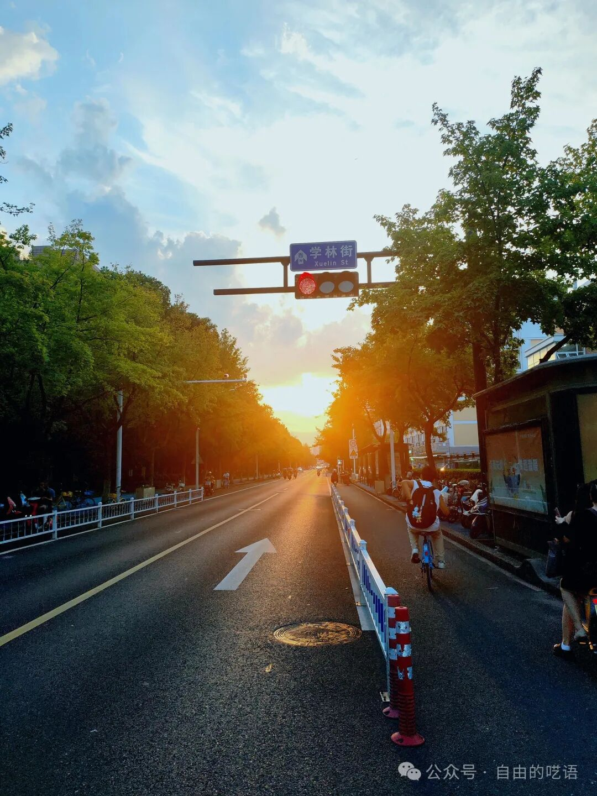
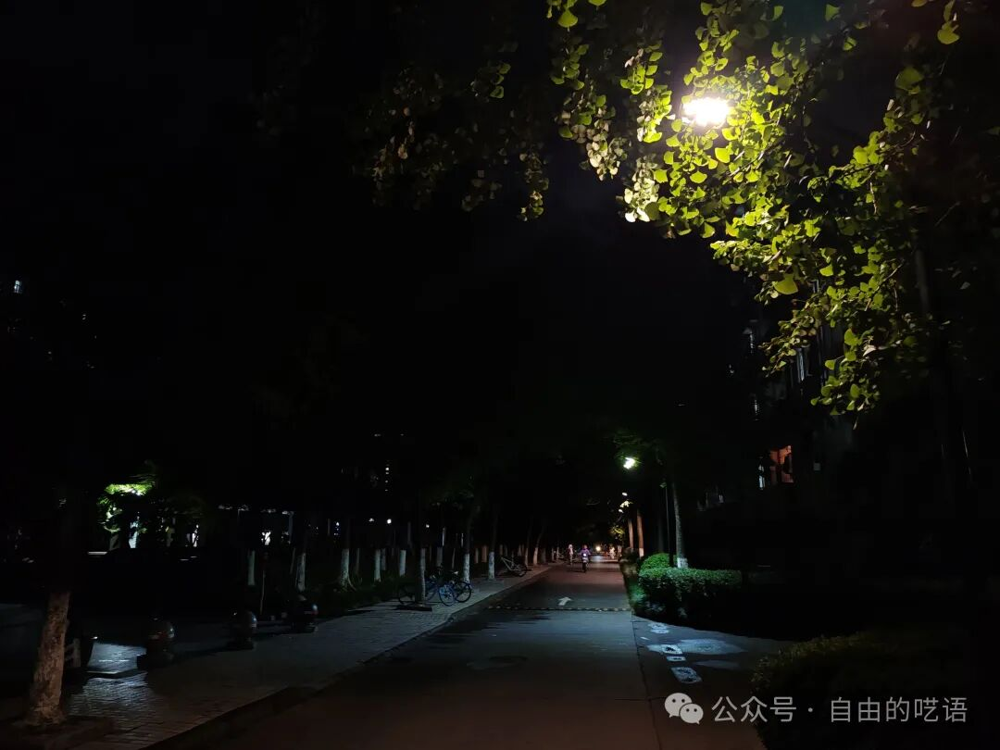
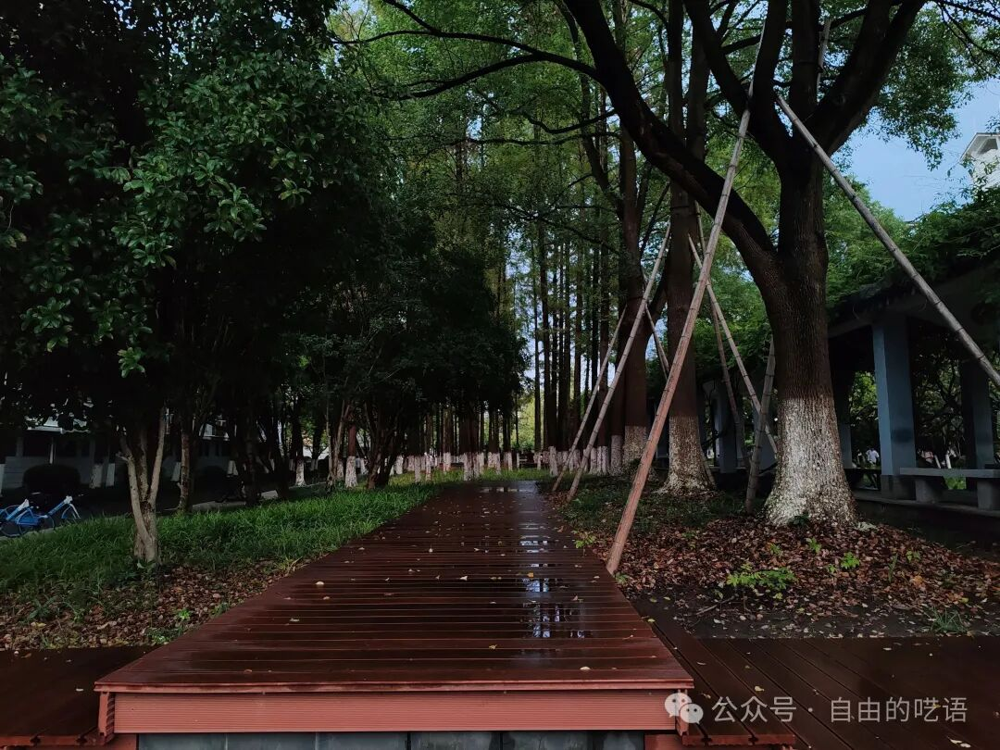
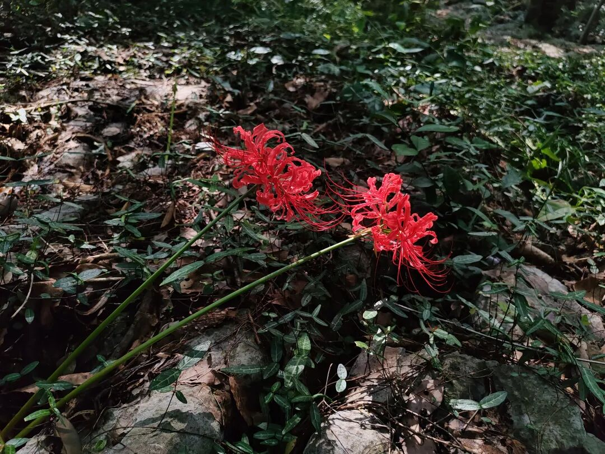

> 每个人都有自己的表达方式，如果你不喜欢，只能说明不是为你准备的。   

>你可以不接受，这是一种自由。但不屑和抨击，翻到另外一个世界观，只能说明你的无知和武断。    

>不管这是书评还是自己的无病呻吟
今天看完了《从你的全世界路过》
读下来，摘了一句又一句的话，可是，我却不太懂这些，但不妨碍我去欣赏，崇拜这些文字。

人与人之间的相遇，大多是路人吧，每个路过的，转瞬即逝的美好，都在告诉我，要活在当下，要珍惜眼前人。可是啊，多么想要像看3000次日落一般，一次一次的与路过的美好再次相遇。

***上帝不会允许这种事情发生的，我们唯一能做的，就是珍惜，昙花一现的美好，尽力，努力抓住，亦或是记住。    ***

从你的身旁擦肩而过并非悲剧，悲剧在于从你的全世界路过，而在这之后，我走的路，只不过是在寻找你的全世界罢了，人要先爱自己，才能爱别人，只有自己有一颗温暖的心房，在装下别人的时候，才能不让别人淋雨。

世界上也许真的有和你完美百分百契合的半圆，不过这概率很小，分母如此浩瀚，分子如此微小，唯一就等于没有。   
所以哪有所谓的契合，不过是一个自私灵魂找寻另一个自私的灵魂。   

爱情就这样一个永恒而浪漫的话题，晦涩又难懂，朦胧而又美好。   

与一个人相遇，他/她会改变你，而改变的部分，在他/她走后，代替了原来的他/她，陪伴着你。   

“原本你是想去找一个人的影子，在歌曲的间奏里，在无限的广阔里,在四季的缝隙里，在城市的黄昏里。结果脚印越来越远，河岸越来越近，然后看到，那些时刻在记忆中闪烁的影子，其实是自己的。与其怀念，不如向往，与其向往，不如该放就放去远方。”    

在寻找他/她的路上，发现不过是在自己身上找寻他留下的印记。  

人与人相遇不止路过，还有一个词语，叫做“等待”。这真是浪漫而又美好的词啊，不过，岁月不等你，流年不等你，你等的她/他，也许并未向你走来，又何必驻足停留，让此地慢慢沙化，沙子入了眼，泪流满面。   

>“他还徜徉在一条马路上，瘦瘦的少年满脸泪水，踩着梧桐叶和自己的抽泣声，被无数匆忙的行人超过。”
 
少年懂得:   
>“我们走在单行道上，所以，大概都会错过吧”

也知道    

>“季节走在单行道上，所以，就算你停下脚步等待，为你开出的花，也不是原来那一朵了。”

于是乎，少年    

>“靠着树干坐下，头顶满树韶光，枝叶的罅隙里斜斜透着记忆，落满一地思念。醒来拍拍裤管，向不知名的地方去。”

少年每一步都走在记忆的罅隙中，每一步走的坚毅，把满地的思念踩得粉碎，最后被风吹走，变成思念的风，吹给思念的人。

>”他是带着思念去的，一个人的旅途，两个人的温度，无论到哪里都是在等她。那么，也许并不需要其他人打扰。“

>“世界美好无比。晴时满树花开，雨天一湖涟漪，阳光席表城市，微风穿越指间，入夜每个电台播放的情歌，沿途每条山路铺开的影子”，可是少年安静的对自己说道：“啊哈，原来你不在这里。“

>“世事如书，我偏爱你这一句，愿做个逗号，待在你身边。”
但你有自己的朗读者，而我只是一个摆渡人”

- 你不是逗号，你只是TAB键罢了

多么希望相遇之时的时间永恒的停滞，哪怕之后的一生就此消除。眼泪留在眼角，微风抚摸微笑，手掌牵住手指，回顾变为回见。
从此定格成一张相片，两场生命组合成相框，漂浮在蓝色的海洋里。我们说好，可是时间说不好。

希望去见莽莽昆仑，天地间奔涌万里雪山。去破一片冰封，南北极卧看昼夜半年。看着孤独的日，守着暗淡的夜，捧着书籍，晒着月光，想要这一切的状语，是一起，而不是独自，哪怕跋山涉水，哪怕刀山火海，哪怕……

>”故事开头总是这样，适逢其会，猝不及防。故事的结局总是这样，花开两朵，天各一方。“

天各一方，也总要花开两朵。